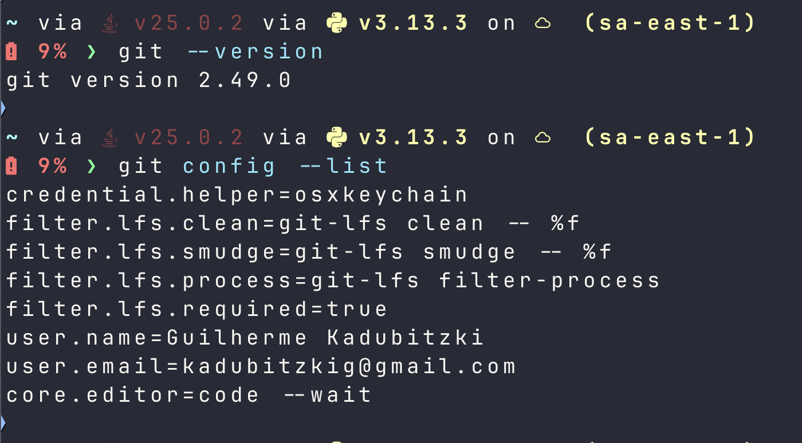
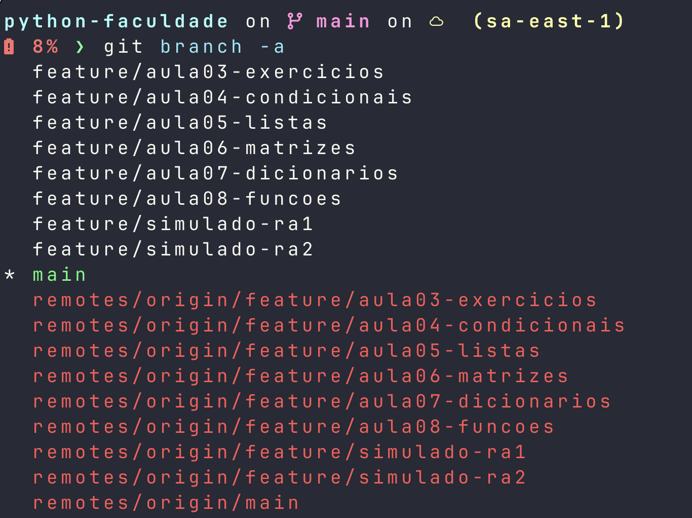
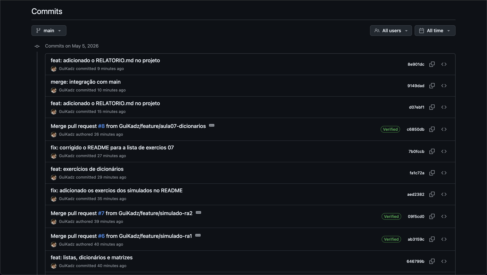
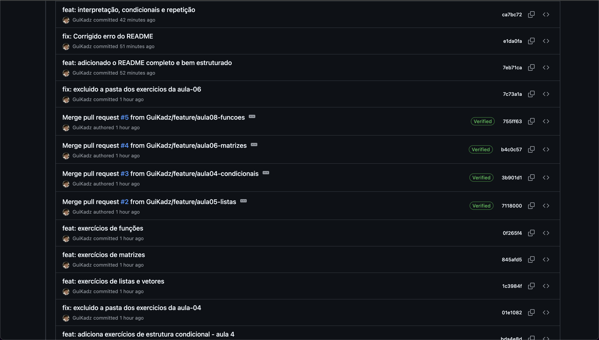
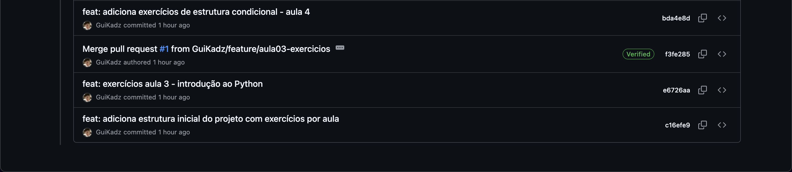
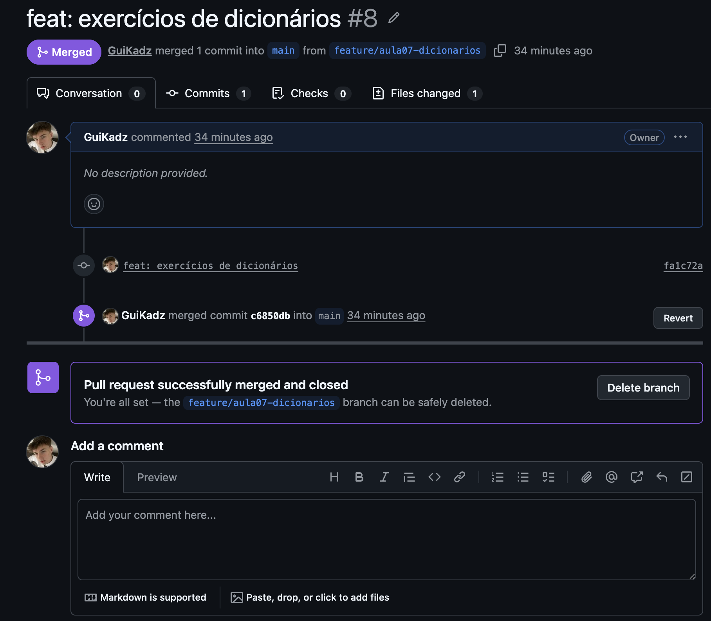
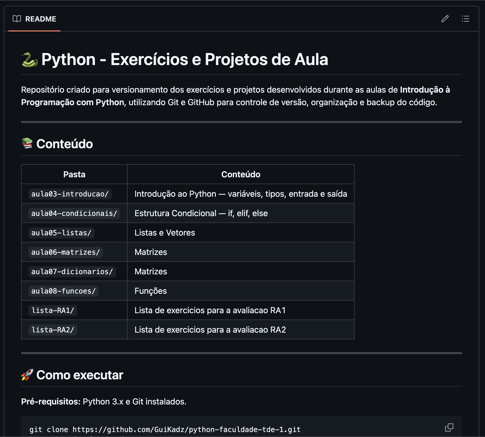

# Relatório TDE 1 — Versionamento com Git e GitHub

**Disciplina:** Raciocínio Algorítmico  
**Instituição:** Pontifícia Universidade Católica do Paraná  
**Aluno:** Guilherme Moczedlo Kadubitzki  
**GitHub:** [@GuiKadz](https://github.com/GuiKadz)  
**Semestre:** 1º Semestre / 2026  
**Entrega:** 06/05/2026

---

## 1. Introdução

Este relatório documenta o desenvolvimento do TDE 1, cujo objetivo foi aplicar os conceitos de versionamento de código utilizando Git e GitHub ao longo das aulas práticas de programação em Python. Ao longo do semestre, cada conjunto de exercícios foi organizado em um repositório estruturado, com branches dedicadas, commits descritivos e pull requests registrados, consolidando boas práticas de desenvolvimento desde o início da formação.

---

## 2. Conceitos Estudados

### 2.1 Git

Git é um sistema de controle de versão distribuído, criado por Linus Torvalds em 2005. Ele permite rastrear alterações em arquivos ao longo do tempo, possibilitando reverter para versões anteriores, trabalhar em paralelo com branches e colaborar com outros desenvolvedores sem sobrescrever o trabalho alheio.

Os principais conceitos utilizados no projeto foram:

- **Repositório:** diretório monitorado pelo Git, onde todo o histórico de alterações é armazenado.
- **Commit:** registro de uma alteração, acompanhado de uma mensagem descritiva.
- **Branch:** ramificação do histórico principal, usada para desenvolver funcionalidades de forma isolada.
- **Merge:** integração de uma branch ao código principal.
- **Pull Request:** solicitação formal de integração de código, comum em fluxos colaborativos.

### 2.2 GitHub

GitHub é uma plataforma de hospedagem de repositórios Git na nuvem. Além do armazenamento, oferece ferramentas para revisão de código, abertura de issues, documentação via README e controle de acesso. Foi utilizado como plataforma central para publicação de todos os exercícios desenvolvidos em aula.

### 2.3 Conventional Commits

Para padronizar as mensagens de commit, foi adotado o padrão Conventional Commits, que define prefixos semânticos:

| Prefixo | Uso |
|---|---|
| `feat:` | Novo exercício ou funcionalidade adicionada |
| `fix:` | Correção de um exercício |
| `docs:` | Alteração na documentação |
| `refactor:` | Refatoração sem mudança de comportamento |

---

## 3. Configuração do Ambiente

O Git foi instalado e configurado localmente com as informações do autor antes do início dos commits:

```bash
git config --global user.name "Guilherme Moczedlo Kadubitzki"
git config --global user.email "seu-email@exemplo.com"
git --version
```


---

## 4. Repositório

O repositório principal do projeto está disponível em:

**[https://github.com/GuiKadz/python-faculdade-tde-1](https://github.com/GuiKadz/python-faculdade-tde-1)**

### 4.1 Estrutura de Pastas

```
python-faculdade-tde-1/
├── aula03-introducao/
├── aula04-condicionais/
├── aula05-listas/
├── aula06-matrizes/
├── aula07-dicionarios/
├── aula08-funcoes/
├── lista-RA1/
├── lista-RA2/
└── README.md
```

Cada pasta contém o arquivo `.py` com os exercícios da respectiva aula, desenvolvido e commitado de forma independente em sua branch.

---

## 5. Branches e Fluxo de Trabalho

O desenvolvimento seguiu um fluxo baseado em feature branches: cada aula foi desenvolvida em uma branch separada e posteriormente integrada à `main` via pull request.

| Branch | Descrição |
|---|---|
| `main` | Código estável, recebe merges das branches de aula |
| `feature/aula03-introducao` | Exercícios de introdução ao Python |
| `feature/aula04-condicionais` | Estruturas condicionais |
| `feature/aula05-listas` | Listas e vetores |
| `feature/aula06-matrizes` | Matrizes |
| `feature/aula07-dicionarios` | Dicionários |
| `feature/aula08-funcoes` | Funções |
| `feature/simulado-ra1` | Exercícios de preparação para o RA1 |
| `feature/simulado-ra2` | Exercícios de preparação para o RA2 |

Fluxo executado para cada aula:

```bash
git checkout -b feature/aulaXX-tema
# desenvolvimento do arquivo .py
git add nome-do-arquivo.py
git commit -m "feat: exercícios da aulaXX - tema"
git push origin feature/aulaXX-tema
# abertura de Pull Request no GitHub
# merge na main após revisão
```


---

## 6. Commits

Os commits foram organizados com mensagens descritivas seguindo o padrão Conventional Commits. Exemplos de commits realizados:

```
feat: aula03 - exercícios de introdução ao Python
feat: aula04 - exercícios de condicionais
feat: aula05 - exercícios de listas e vetores
feat: aula06 - exercícios de matrizes
feat: aula07 - exercícios de dicionários
feat: aula08 - exercícios de funções
feat: simulado RA1 - conteúdos da primeira avaliação
feat: simulado RA2 - listas, dicionários e matrizes
docs: README estruturado com documentação do repositório
```




---

## 7. Pull Requests e Merges

Para cada branch de aula, foi aberto um Pull Request no GitHub solicitando a integração com a `main`. O processo seguiu os passos:

1. Push da branch para o repositório remoto
2. Abertura do Pull Request com título e descrição
3. Revisão do código
4. Merge na `main`



---

## 8. Documentação

O repositório conta com um README estruturado na raiz, contendo:

- Descrição do projeto e disciplina
- Tabela de conteúdo com as pastas e seus temas
- Instruções para clonar e executar os arquivos
- Tabela de branches com descrições
- Padrão de commits adotado
- Checklist dos objetivos de aprendizado
- Informações do autor e da disciplina



---

## 9. Objetivos Alcançados

| Objetivo | Status |
|---|---|
| Compreender os conceitos básicos do Git e GitHub | ✅ |
| Configurar o Git no ambiente de desenvolvimento | ✅ |
| Criar e gerenciar repositórios no GitHub | ✅ |
| Versionar código com commits organizados | ✅ |
| Utilizar branches para novas funcionalidades | ✅ |
| Realizar pull requests e merges | ✅ |
| Documentar projetos com README estruturado | ✅ |

---

## 10. Conclusão

O desenvolvimento do TDE 1 permitiu colocar em prática os fundamentos do controle de versão com Git e GitHub de forma aplicada ao contexto acadêmico. A organização em branches, o uso de mensagens de commit padronizadas e a documentação via README contribuíram para a construção de um repositório limpo e rastreável. Essas práticas são diretamente transferíveis para projetos profissionais e servirão de base para as disciplinas seguintes.

---

## 11. Links

- **Repositório:** https://github.com/GuiKadz/python-faculdade-tde-1
- **Pull Requests:** https://github.com/GuiKadz/python-faculdade-tde-1/pulls
- **Commits:** https://github.com/GuiKadz/python-faculdade-tde-1/commits/main